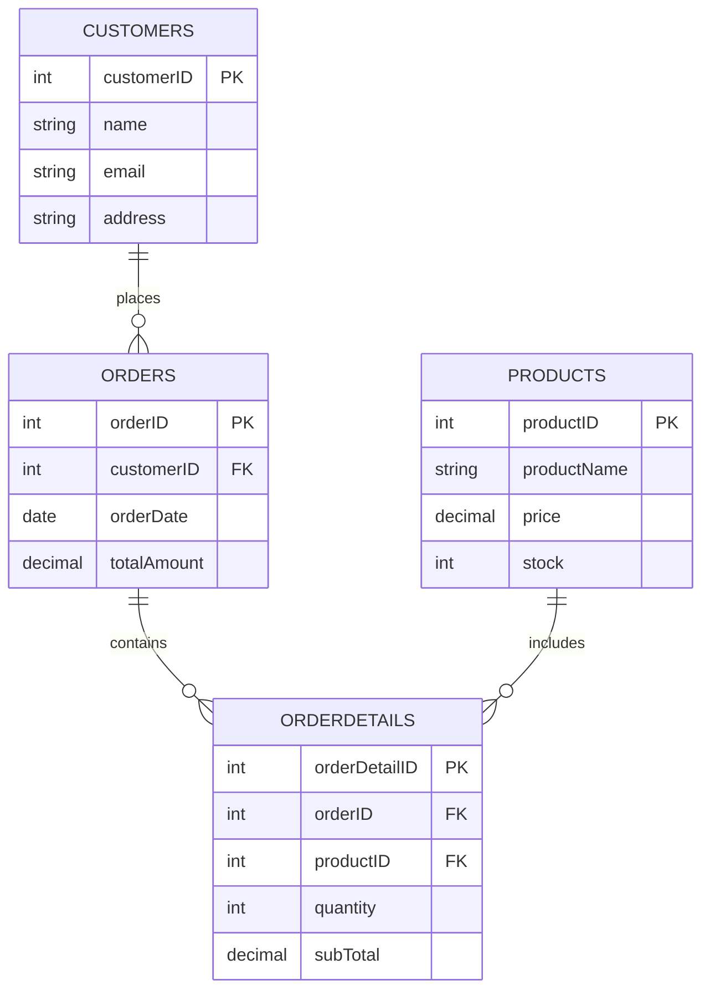

# DATA-DIGGER-
<div align="center">


[](https://git.io/typing-svg)

<br>


</div>

<div align="center">

> 💭 *"Data is the new oil, but SQL is the engine that refines it."*

</div>

<br>


## **📖 Table of Contents**

<div align="center">

| 📌 | 🗂️ | ⚙️ | 💡 | 🛠️ | 🚀 | 🤝 | 📬 | 🙏 |
|:---:|:---:|:---:|:---:|:---:|:---:|:---:|:---:|:---:|
| [Overview](#-project-overview) | [Schema](#️-database-schema) | [Operations](#️-operations-covered) | [Queries](#-sample-query-highlights) | [Tech Stack](#️-tech--skills-used) | [Usage](#-how-to-use) | [Contribute](#-contributing) | [Feedback](#-feedback) | [Thanks](#-thank-you) |

</div>


<br>

## **📌 Project Overview**


This project simulates the backend database of a simple **e-commerce platform** 🛍️. It covers database design, CRUD operations, foreign-key relationships, aggregate functions, and analytical queries across four related tables:

- 🧑 **Customers** — who's buying
- 📦 **Orders** — what they bought & when
- 🛒 **Products** — the catalog & inventory
- 🧾 **OrderDetails** — the bridge tying it all together

<br clear="right">


## **🗂️ Database Schema**

<div align="center">



</div>

| Table | Description |
|:------|:------------|
| 🧑 `customers` | Stores customer details — ID, name, email, address |
| 📦 `orders` | Stores order info linked to a customer |
| 🛒 `products` | Stores product catalog with price & stock |
| 🧾 `orderdetails` | Bridge table linking orders ↔ products with quantity & subtotal |

<details>
<summary>🔍 <b>Click to expand full CREATE TABLE scripts</b></summary>

```sql
CREATE TABLE customers (
    customerID   INT PRIMARY KEY,
    name         VARCHAR(50),
    email        VARCHAR(100),
    address      VARCHAR(100)
);

CREATE TABLE orders (
    orderID      INT PRIMARY KEY,
    customerID   INT,
    orderDate    DATE,
    totalAmount  DECIMAL(10,2),
    FOREIGN KEY (customerID) REFERENCES customers(customerID)
);

CREATE TABLE products (
    productID    INT PRIMARY KEY,
    productName  VARCHAR(200),
    price        DECIMAL(10,2),
    stock        INT
);

CREATE TABLE orderdetails (
    orderDetailID INT PRIMARY KEY,
    orderID       INT,
    productID     INT,
    quantity      INT,
    subTotal      DECIMAL(10,2),
    FOREIGN KEY (orderID) REFERENCES orders(orderID),
    FOREIGN KEY (productID) REFERENCES products(productID)
);
```

</details>

> ⚠️ **Note:** A few small syntax fixes were made from the original draft — missing commas, mismatched column names (`cust_EmaiL` → `email`, `customer address` → `address`), and a missing `CREATE TABLE orders` line. `orderdetails` also got its own primary key since `orderID` repeats across multiple products in the same order.


## **⚙️ Operations Covered**

<div align="center">

| Operation | Description |
|:---------:|:-------------|
| ✅ **INSERT** | Adding sample records into all 4 tables |
| 🔍 **SELECT** | Retrieving full/filtered data |
| ✏️ **UPDATE** | Modifying address, price, and order amount |
| ❌ **DELETE** | Removing customers, orders & out-of-stock products |
| 📅 **Date Filtering** | Orders placed in the last 30 days |
| 📊 **Aggregates** | `MAX()` `MIN()` `AVG()` `SUM()` `COUNT()` |
| 🏆 **GROUP BY + LIMIT** | Top 3 most ordered products |
| 🔗 **Foreign Keys** | Relational integrity between all tables |

</div>


## **💡 Sample Query Highlights**

**🏅 Top 3 Most Ordered Products**
```sql
SELECT productID, SUM(quantity) AS totalQuantity
FROM orderdetails
GROUP BY productID
ORDER BY totalQuantity DESC
LIMIT 3;
```

**💰 Total Revenue Generated**
```sql
SELECT SUM(subTotal) AS totalRevenue FROM orderdetails;
```

**📈 Highest, Lowest & Average Order Value**
```sql
SELECT MAX(totalAmount) AS highest,
       MIN(totalAmount) AS lowest,
       AVG(totalAmount) AS average
FROM orders;
```


## **🛠️ Tech & Skills Used**

<div align="center">


<br><br>


</div>


## **🚀 How to Use**

1. 📥 Clone this repository
2. 🖥️ Open your favorite SQL client (PostgreSQL / MySQL Workbench / SQLite)
3. 🏗️ Run the schema creation scripts first, then the `INSERT` statements
4. 🔎 Explore the queries section by section
5. 🧪 Modify and experiment — that's the best way to learn!


## **🤝 Contributing**

Contributions are always welcome! If you'd like to add more queries, optimize existing ones, or fix something:

```
🍴 Fork  ➜  🌿 Branch  ➜  💾 Commit  ➜  📤 Push  ➜  🔁 Pull Request
```

Even small improvements like better comments or additional edge-case queries are appreciated! 🌟


## **📬 Feedback**

Got suggestions, spotted a bug, or have an idea to make this better?

💌 Feel free to open an **Issue** or drop a **Pull Request** — all feedback is welcome and genuinely appreciated! Your input helps this project grow. 🌱


<div align="center">

> 💭 *"Every expert was once a beginner who refused to give up."*

## **✨ Author**


### **Kavita Khushalani**


</div>

<br>

## **🙏 Thank You**

<div align="center">

Thanks a ton for checking out this project! ⭐ If you found it useful, don't forget to **star this repo** — it motivates a lot and helps others discover it too. Happy Querying! 🎉


</div> 
